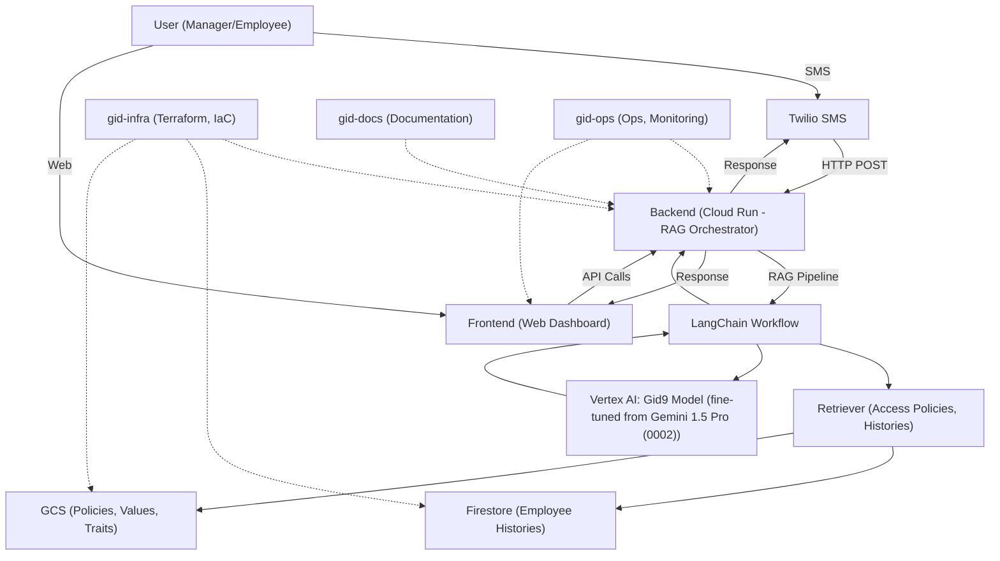

# Gid 9 Architecture - Directory Structure

```mermaid
graph TD
    %% Users and Interfaces
    User["User (Manager/Employee)"] -->|SMS| Twilio["Twilio SMS"]
    User -->|Web| Frontend["Frontend (Web Dashboard)"]

    %% Backend Orchestration (Cloud Run)
    Twilio -->|HTTP POST| Backend["Backend (Cloud Run - RAG Orchestrator)"]
    Frontend -->|API Calls| Backend

    %% LangChain / RAG Workflow
    Backend -->|RAG Pipeline| LangChain["LangChain Workflow"]
    LangChain --> Retriever["Retriever (Access Policies, Histories)"]

    %% Data Sources (Consistent with Previous Architecture)
    Retriever --> FS["Firestore (Employee Histories)"]
    Retriever --> GCS["GCS (Policies, Values, Traits)"]

    %% Vertex AI Integration
    LangChain --> VAI["Vertex AI: Gid9 Model (fine-tuned from Gemini 1.5 Pro (0002))"]
    VAI --> LangChain

    %% Response Formatting & Return Path
    LangChain --> Backend
    Backend -->|Response| Twilio
    Backend -->|Response| Frontend

    %% Infrastructure & Operations (Separate Repos)
    Infra["gid-infra (Terraform, IaC)"] -.-> Backend
    Infra -.-> FS
    Infra -.-> GCS
    Docs["gid-docs (Documentation)"] -.-> Backend
    Ops["gid-ops (Ops, Monitoring)"] -.-> Backend
    Ops -.-> Frontend

    %% Additional Notes
    %% - The Backend executes the RAG pipeline using LangChain, retrieves data from Firestore and GCS,
    %%   and invokes the Gid9 model on Vertex AI.
    %% - Gid9 is a fine-tuned model based on Gemini 1.5 Pro (0002), aligned with previous architecture discussions.
    %% - Separate repositories (gid-backend, gid-docs, gid-infra, gid-ops) reflect the recommended structure:
    %%   * gid-backend: Source code and RAG orchestration
    %%   * gid-docs: Documentation (includes architecture)
    %%   * gid-infra: Infrastructure as code (Terraform)
    %%   * gid-ops: Monitoring, logging, alerts


```

